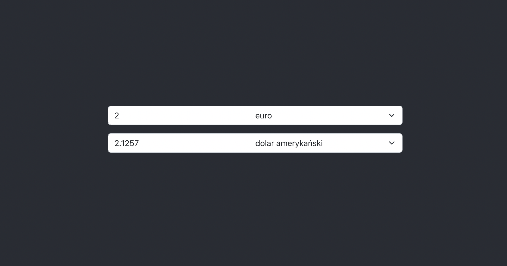
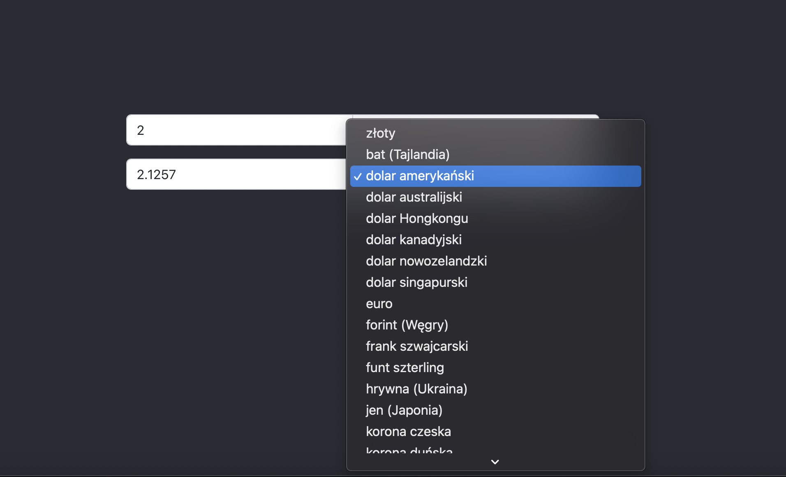

# Currency Converter Web App

## **Prerequisites:**
* docker - if not installed, you can get it from  https://docs.docker.com/get-docker/
* docker compose - if not installed, you can get it from https://docs.docker.com/compose/install/

## **How to run the application:**
* In the main app directory (currency-converter), run in terminal the following command:

        docker-compose up
* When the containers are up and running, the app will be available at: 

        http://localhost:3001

## **How to run the application without docker**:

To run the application without docker, you need to have installed:

* Golang (preferebly version 1.17 or above) - if dont have, you can get it from https://go.dev/
* Node.js (preferebly version 16.14.2 or newer) - if dont have, you can get it from https://nodejs.org/en/
* NPM or YARN, I've used NPM, so the following instruction will be for NPM - if dont have NPM, you can get it from https://www.npmjs.com/package/npm

When you installed the prerequisites, go to currency-converter/backend directory and run this command in the terminal:

        go run main.go

Next move to currency-converter/frontend directory and run the command in the terminal:

        npm install

and then run:

        npm run start

When the app is loaded, it should be available at:

        http://localhost:3000

Depending on the configuration, the port number may vary but most likely it will port 3000.

## **Troubleshooting**:

1. If running it on docker, make sure that ports 3001 and 9090 are available, if not then change ports for available ones. To do it you need to change ports in following files:

    *   docker-compose (port 9090 and 3001)
    *   backend/dockerfile (port 9090)
    *   backend/main.go (port 9090)
    *   frontend/src/types enviroments.ts (port 9090)
    *   frontend/nginx.conf (port 9090)

    don't forget to remove docker containers and images as it can cause errors.
2. If you run it without docker, make sure that the 9090 port is available, if not then change it to available one. To do it modify following files:
    *   backend/main.go 
    *   frontend/src/types enviroments.ts

## **The application presents as follows**:
    

